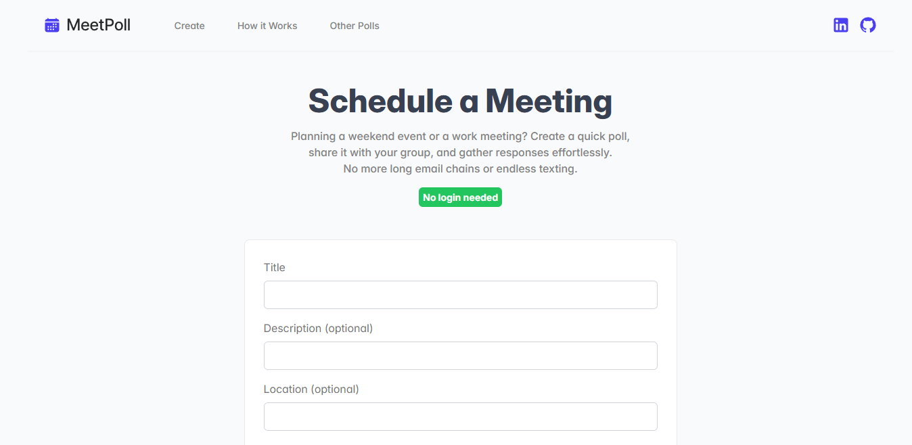

# MeetPoll

[//]: # (    )

Schedule meetings by creating custom polls and sharing them with friends or co-workers to get instant feedback on the best time.

Built with React, Express, Typescript and Vite.



---
## 🚀 Setup

Run docker:

```bash
docker-compose up
```

Open [http://localhost:5173](http://localhost:5173/) with your browser to see the result.

---
## 📃 License
Open-source and licensed under the GNU GPLv3. See [LICENSE.txt](LICENSE.txt) for more information.